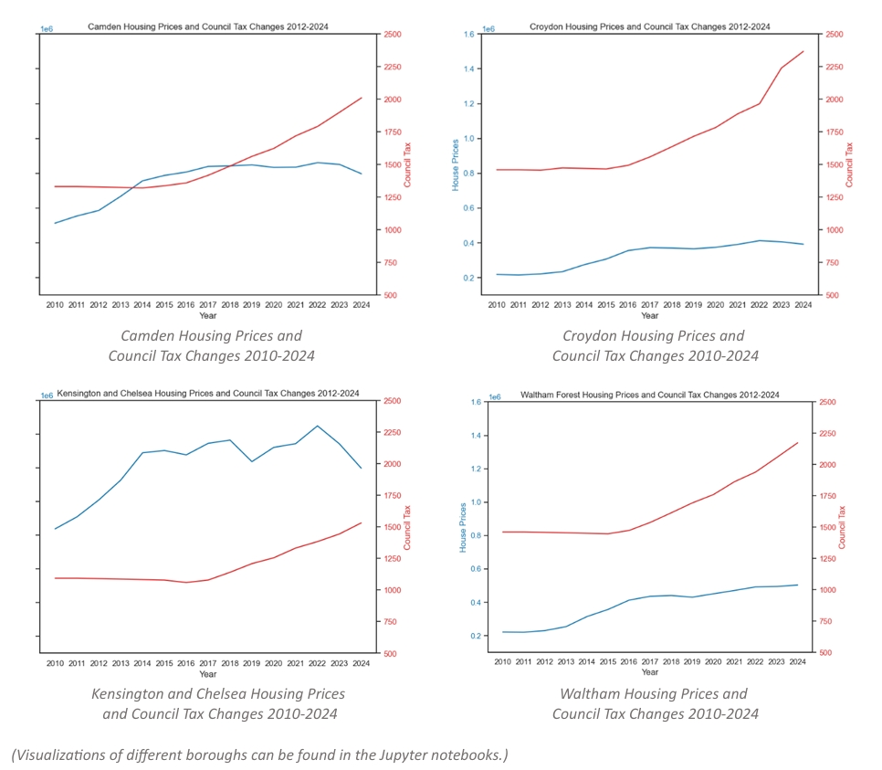
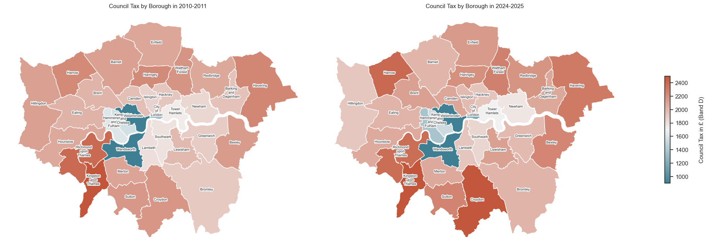
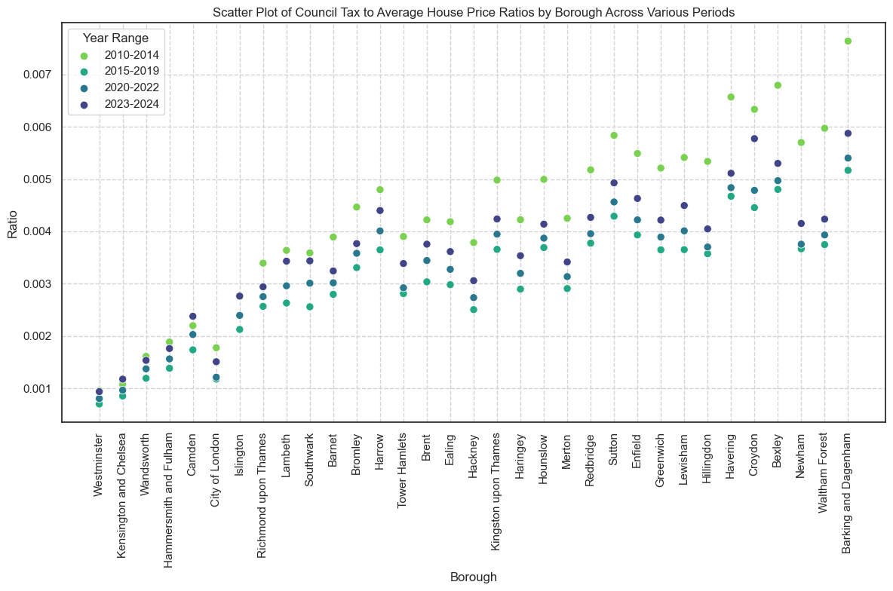
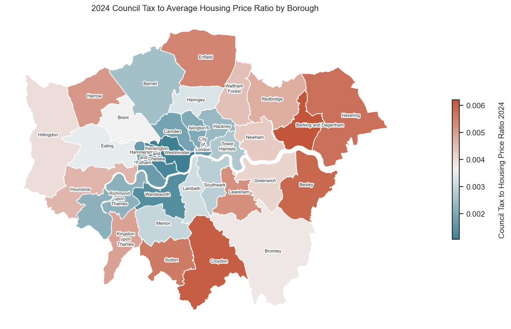
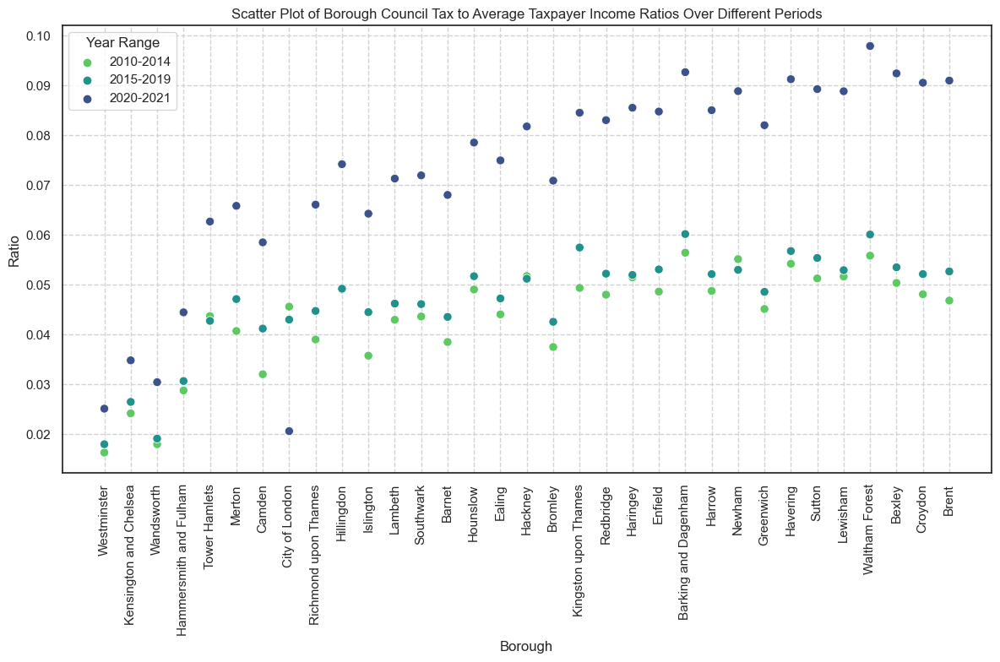
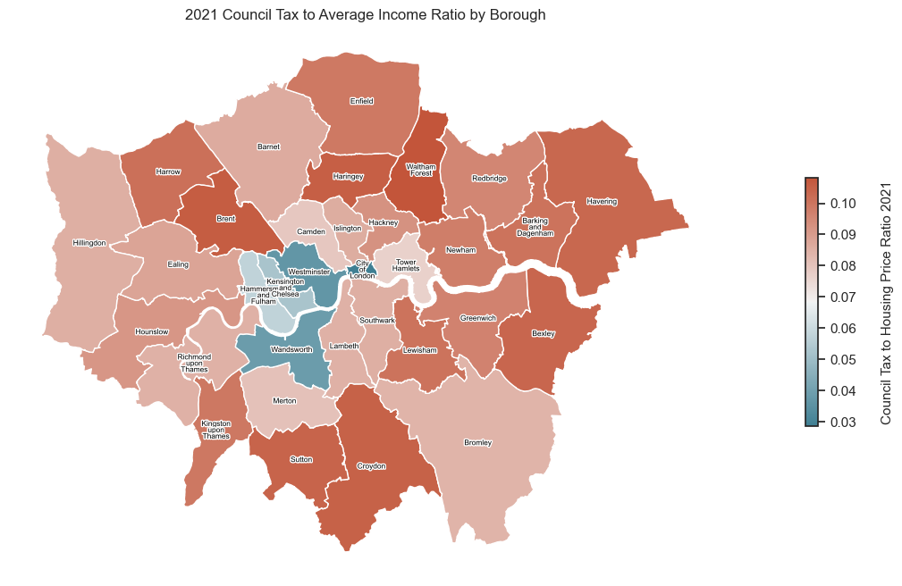
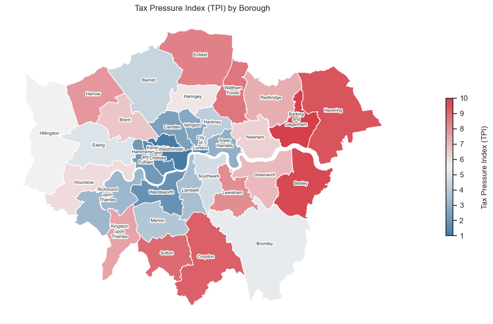
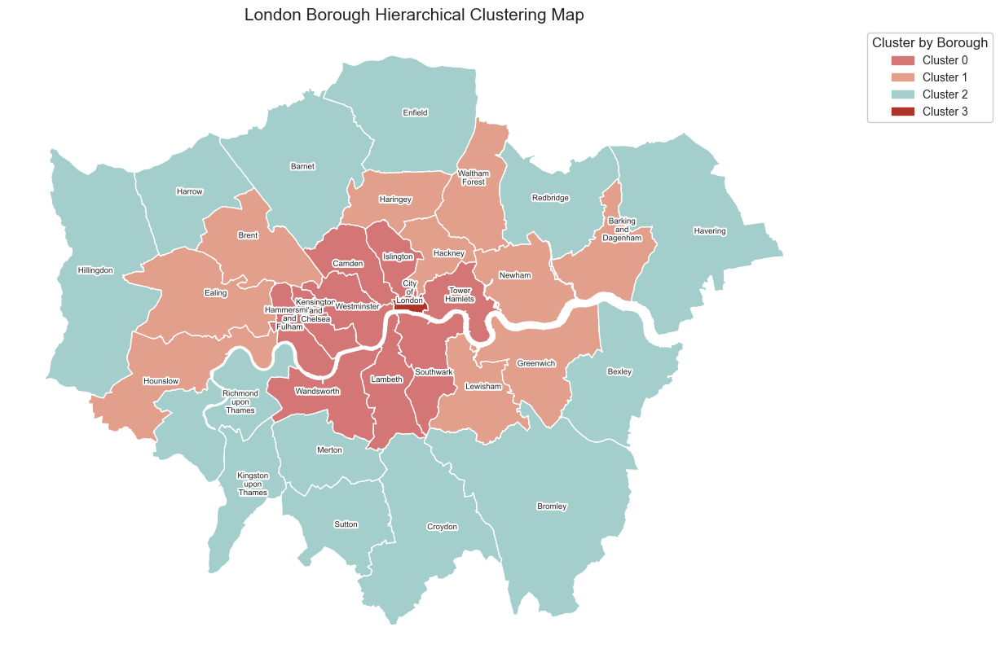

# Strategies for Fairer Council Tax in London
This project from the "Analytics for Urban Policy" module during my master’s programme addresses the challenges of council tax in London, which is still based on property values from 1991. These outdated valuations do not reflect current pricing variations. Descriptive statistics and visualisations were employed to analyse the relationship between council tax, average income, and housing prices. A Tax Pressure Index (TPI) was developed to evaluate the fairness of council tax across different boroughs. Clustering techniques were then applied to categorise boroughs, with the goal of proposing a more equitable council tax valuation system across London.

 

## Findings and Discussion
### 1. Variation in Council Tax and Average Housing Prices Across Different Boroughs from 2010 to 2024  

### 2. Variation in Council Tax Across Different Boroughs from 2010 to 2024  

### 3. Fairness of Council Tax

  - **Ratio of Council Tax to Average Housing Price (2010-2024)**  
      
    

  - **Ratio of Council Tax to Average Taxpayer Income (2010-2021)**  
      
    

  - **Tax Pressure Index**  
    

### 4. Clustering of London Boroughs  

